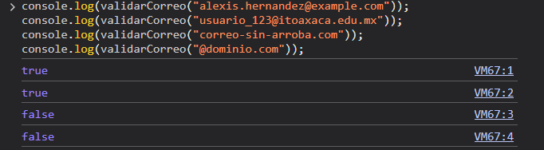
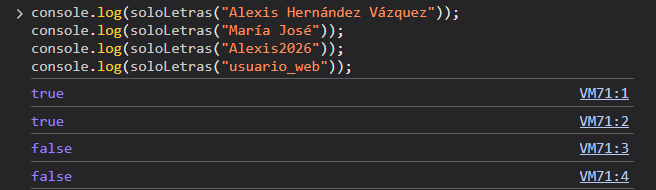
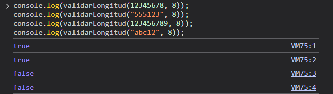
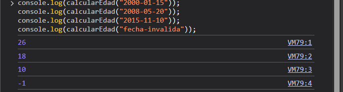
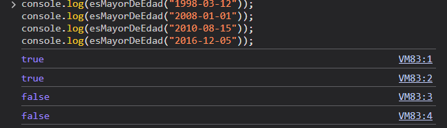
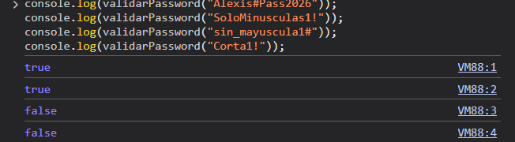
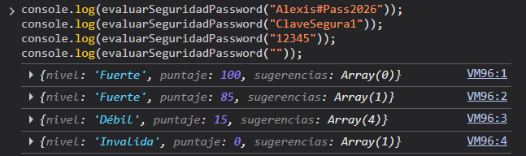
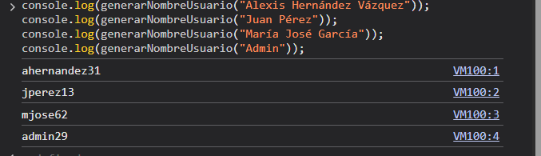

# INSTITUTO TECNOLÓGICO NACIONAL DE MÉXICO
## INSTITUTO TECNOLÓGICO DE OAXACA
- **Carrera:** Ingeniería en Sistemas Computacionales
- **Materia:** Programación Web
- **Unidad:** Unidad 2
- **Docente:** Adelina Martínez Nieto
- **Alumno:** Alexis Hernández Vázquez
- **Hora:** 10:00 - 11:00
- **Fecha de entrega:** 24 de septiembre del 2026

---

# Utilería — Librería de Validación y Utilidades JavaScript

## ¿Qué problema resuelve?

Todo el tiempo se tienen problemas, no importa si es hoy, mañana o ayer, es una constante, pero con eso llega otra cuestión, todos tienen problemas, y es aquí donde entra una pregunta: ¿Alguien ya tuvo este problema? Probablemente sí, y eso es lo que se busca hacer con utileria.js: ayudar a no reinventar la rueda y que simplemente la puedan usar.

Utilería resuelve esto ofreciendo una colección de funciones puras de JavaScript que pueden incluirse en cualquier proyecto web para:
- Validar formatos de correo electrónico y contraseñas seguras.
- Verificar que campos contengan solo letras o tengan una longitud máxima.
- Calcular edad a partir de una fecha de nacimiento y determinar si alguien es mayor de edad.
- Evaluar el nivel de seguridad de contraseñas y generar identificadores de usuario automáticamente.

---

## Estructura del Repositorio

```text
utileria/
├── README.md
├── index.html          ← Formulario de registro + modal
├── login.html          ← Página de inicio de sesión
├── css/
│   └── styles.css      ← Estilos para formularios y modal
└── js/
    ├── utileria.js     ← Librería de funciones puras JavaScript
    ├── registro.js     ← Lógica e interacción del formulario de registro
    └── login.js        ← Lógica e interacción del formulario de login
```

---

## Instalación

No se necesitan gestores de paquetes ni herramientas de compilación. Solo copia el archivo `utileria.js` en tu proyecto y enlázalo en tu HTML antes de tus controladores de eventos:

```html
<script src="js/utileria.js"></script>
```

---

## Funciones y resultados

### 1. validarCorreo(correo) → boolean

Valida que una cadena tenga formato de correo electrónico válido.

```javascript
validarCorreo("usuario@ejemplo.com");     // true
validarCorreo("nombre.apellido@dom.com"); // true
validarCorreo("user+tag@domain.org");     // true
validarCorreo("invalido");                // false
validarCorreo("@sin-usuario.com");        // false
validarCorreo("sin-dominio@");            // false
validarCorreo("");                        // false
```

### 2. soloLetras(texto) → boolean

Verifica que una cadena contenga solo letras (mayúsculas, minúsculas) y espacios. Acepta vocales acentuadas y ñ.

```javascript
soloLetras("Alexis Hernández"); // true
soloLetras("ANA");              // true
soloLetras("ñandú");            // true
soloLetras("José");             // true
soloLetras("Ana123");           // false
soloLetras("María José 2");     // false
soloLetras("texto-con-guiones");// false
```

### 3. validarLongitud(numero, maxLongitud) → boolean

Valida que la representación en cadena de un número no exceda una longitud máxima de dígitos.

```javascript
validarLongitud(12345678, 8);   // true  → 8 dígitos
validarLongitud(12345, 8);      // true  → 5 dígitos
validarLongitud(123456789, 8);  // false → 9 dígitos
validarLongitud("abc12", 8);    // false → no numérico
```

### 4. calcularEdad(fechaNacimiento) → number

Calcula la edad en años cumplidos a partir de una fecha de nacimiento en formato "YYYY-MM-DD".

```javascript
calcularEdad("2000-01-01"); // 26
calcularEdad("1990-06-15"); // 36
calcularEdad("2010-12-25"); // 15
calcularEdad("");           // -1
```

### 5. esMayorDeEdad(fechaNacimiento) → boolean

Determina si una persona tiene 18 años o más.

```javascript
esMayorDeEdad("2000-01-01"); // true  → tiene 26 años
esMayorDeEdad("2010-06-20"); // false → menor de edad
esMayorDeEdad("2008-01-01"); // true  → tiene 18 años

// Uso en formulario o controlador
if (!esMayorDeEdad(fechaNacimiento)) {
    alert("Debe ser mayor de edad para acceder.");
}
```

### 6. validarPassword(password) → boolean

Valida que una contraseña cumpla con los requisitos de seguridad:
- Mínimo 8 caracteres
- Al menos una letra mayúscula (A-Z)
- Al menos una letra minúscula (a-z)
- Al menos un número (0-9)
- Al menos un carácter especial (!@#$%^&*...)

```javascript
validarPassword("Alexis#Pass2026"); // true
validarPassword("Segura#2024");     // true
validarPassword("clave");           // false → sin mayúscula, número, especial
validarPassword("Corta1!");         // false → menos de 8 caracteres
```

---

## Funciones Adicionales (Sección Libre)

### 7. evaluarSeguridadPassword(password) → object

Analiza la robustez de una contraseña devolviendo su nivel cualitativo ('Débil', 'Media', 'Fuerte'), un puntaje de 0 a 100 y recomendaciones de mejora.

```javascript
evaluarSeguridadPassword("Alexis#Pass2026");
// { nivel: 'Fuerte', puntaje: 100, sugerencias: [] }

evaluarSeguridadPassword("pass123");
// { nivel: 'Débil', puntaje: 30, sugerencias: ['Usa al menos 8 caracteres', 'Agrega letras mayúsculas', ...] }
```

### 8. generarNombreUsuario(nombreCompleto) → string

Genera un nombre de usuario normalizado a partir de nombres y apellidos (limpia acentos y caracteres especiales) y concatena un número aleatorio.

```javascript
generarNombreUsuario("Alexis Hernández"); 
// "ahernandez47" (ejemplo de salida)

generarNombreUsuario("María José García"); 
// "mgarcia82" (ejemplo de salida)
```

---

## Integración en el Proyecto

### Formulario de Registro (index.html)

El formulario captura la información del usuario, genera sugerencias automáticas de nombre de usuario y evalúa contraseñas en tiempo real:

```html
<form id="registroForm" novalidate>
    <div class="form-group">
        <label for="nombre">Nombre Completo</label>
        <input type="text" id="nombre" placeholder="Ej. Juan Pérez">
        <span class="error-text" id="err-nombre">Solo letras y acentos permitidos.</span>
    </div>

    <div class="form-group">
        <label for="usuarioSugerido">Nombre de Usuario (Automático)</label>
        <input type="text" id="usuarioSugerido" placeholder="Se genera con tu nombre" readonly>
    </div>

    <div class="form-group">
        <label for="correo">Correo Electrónico</label>
        <input type="email" id="correo" placeholder="correo@ejemplo.com">
        <span class="error-text" id="err-correo">Formato de correo no válido.</span>
    </div>

    <div class="form-group">
        <label for="matricula">Matrícula / ID (máx. 8 dígitos)</label>
        <input type="text" id="matricula" placeholder="12345678">
        <span class="error-text" id="err-matricula">Solo números y longitud máx. de 8.</span>
    </div>

    <div class="form-group">
        <label for="fechaNac">Fecha de Nacimiento</label>
        <input type="date" id="fechaNac">
        <span class="error-text" id="err-fechaNac">Fecha no válida.</span>
    </div>

    <div class="form-group">
        <label for="password">Contraseña</label>
        <input type="password" id="password" placeholder="Mínimo 8 caracteres (A, a, 1, #)">
        <span class="info-text" id="seguridadPassword"></span>
        <span class="error-text" id="err-password">Mínimo 8 caracteres, mayúscula, minúscula, número y especial.</span>
    </div>

    <button type="submit">Validar y Registrar</button>
</form>
```

```javascript
// Lógica de registro.js
document.addEventListener('DOMContentLoaded', () => {
    // Generación dinámica de nombre de usuario
    inputNombre.addEventListener('blur', () => {
        if (soloLetras(inputNombre.value)) {
            inputUsuario.value = generarNombreUsuario(inputNombre.value);
        }
    });

    // Medidor de seguridad de contraseña interactivo
    inputPassword.addEventListener('input', () => {
        const res = evaluarSeguridadPassword(inputPassword.value);
        seguridadTexto.textContent = `Nivel: ${res.nivel} (${res.puntaje}/100)`;
    });

    // Validación al enviar el formulario
    form.addEventListener('submit', (e) => {
        e.preventDefault();
        // Valida nombre, correo, matrícula, contraseña y edad usando utileria.js
        if (esMayorDeEdad(fechaVal)) {
            modalMensaje.textContent = `Tienes ${edad} años. Cumples con la mayoría de edad para continuar al sistema.`;
            btnIrLogin.style.display = 'block';
        } else {
            modalMensaje.textContent = `Tienes ${edad} años. Registro no autorizado para menores de edad.`;
            btnIrLogin.style.display = 'none';
        }
        modal.classList.add('open');
    });
});
```

### Modal con Edad Calculada

Despliega el resultado de los años cumplidos e impide el acceso al login si es menor de edad:

```html
<div class="modal-overlay" id="modalEdad">
    <div class="modal-card">
        <h2>Resultado de Validación</h2>
        <p id="modalMensaje"></p>
        <div class="modal-actions">
            <button type="button" id="btnIrLogin">Ir al Login</button>
            <button type="button" class="btn-secondary" id="btnCerrarModal">Cerrar</button>
        </div>
    </div>
</div>
```

### Inicio de Sesión (login.html)

Valida credenciales utilizando `validarCorreo()` y `validarPassword()` sin código embebido:

```html
<form id="loginForm" novalidate>
    <div class="form-group">
        <label for="correoLogin">Correo Electrónico</label>
        <input type="email" id="correoLogin" placeholder="tu@correo.com">
        <span class="error-text" id="err-login-correo">Ingresa un correo con formato válido.</span>
    </div>

    <div class="form-group">
        <label for="passLogin">Contraseña</label>
        <input type="password" id="passLogin" placeholder="Tu contraseña">
        <span class="error-text" id="err-login-pass">Debe tener mayúscula, minúscula, número, especial y mín. 8 caracteres.</span>
    </div>

    <button type="submit">Ingresar</button>
</form>
```

---

## Capturas de Pantalla — Consola Mostrando Resultados

### 1. validarCorreo
```javascript
console.log(validarCorreo("alexis.hernandez@example.com")); 
console.log(validarCorreo("usuario_123@itoaxaca.edu.mx"));  
console.log(validarCorreo("correo-sin-arroba.com"));        
console.log(validarCorreo("@dominio.com"));                 
```


---

### 2. soloLetras
```javascript
console.log(soloLetras("Alexis Hernández Vázquez")); 
console.log(soloLetras("María José"));               
console.log(soloLetras("Alexis2026"));               
console.log(soloLetras("usuario_web"));              
```


---

### 3. validarLongitud
```javascript
console.log(validarLongitud(12345678, 8));  
console.log(validarLongitud("555123", 8));  
console.log(validarLongitud(123456789, 8)); 
console.log(validarLongitud("abc12", 8));   
```


---

### 4. calcularEdad
```javascript
console.log(calcularEdad("2000-01-15"));     
console.log(calcularEdad("2008-05-20"));     
console.log(calcularEdad("2015-11-10"));     
console.log(calcularEdad("fecha-invalida")); 
```


---

### 5. esMayorDeEdad
```javascript
console.log(esMayorDeEdad("1998-03-12")); 
console.log(esMayorDeEdad("2008-01-01")); 
console.log(esMayorDeEdad("2010-08-15")); 
console.log(esMayorDeEdad("2016-12-05")); 
```


---

### 6. validarPassword
```javascript
console.log(validarPassword("Alexis#Pass2026")); 
console.log(validarPassword("SoloMinusculas1!")); 
console.log(validarPassword("sin_mayuscula1#")); 
console.log(validarPassword("Corta1!"));         
```


---

### 7. evaluarSeguridadPassword
```javascript
console.log(evaluarSeguridadPassword("Alexis#Pass2026"));
console.log(evaluarSeguridadPassword("ClaveSegura1"));   
console.log(evaluarSeguridadPassword("12345"));           
console.log(evaluarSeguridadPassword(""));                
```


---

### 8. generarNombreUsuario
```javascript
console.log(generarNombreUsuario("Alexis Hernández Vázquez")); 
console.log(generarNombreUsuario("Juan Pérez"));              
console.log(generarNombreUsuario("María José García"));       
console.log(generarNombreUsuario("Admin"));                   
```


---

## Tecnologías

- **HTML5** — Estructura semántica sin scripts embebidos
- **CSS3** — Flexbox, variables nativas, animaciones y diseño responsivo
- **JavaScript vanilla** — Arquitectura desacoplada, sin dependencias ni librerías de terceros

---

## Link al video

https://youtu.be/ltySFvkSe18

---

## Autor

**Alexis Hernández Vázquez**  
Librería de utilería JavaScript